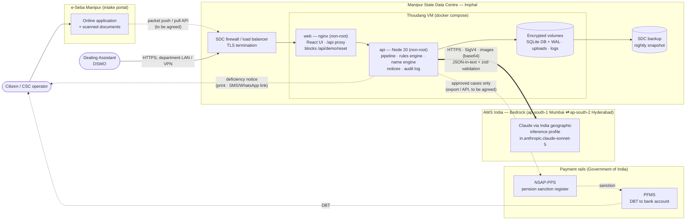

# Thoudang — production architecture

> Target state for a State Data Centre (SDC) deployment after the hackathon prototype.
> The prototype already runs this way on one machine (`docker compose up`); the integrations
> drawn with dashed lines (e-Seba, NSAP-PPS / PFMS) are **interfaces to be agreed** with the
> owning departments — they do not exist in the code yet.

## Principle

**AI reads, code decides, a human makes the final call.** Claude only turns document photos into
structured fields with evidence. Eligibility rules, name matching, prioritisation and notices are
deterministic code in `packages/core`. Only a DSWO can approve; nothing is ever auto-rejected.

## System context



## Request flow for one application

```mermaid
sequenceDiagram
    autonumber
    participant ES as e-Seba / officer upload
    participant API as Thoudang API
    participant AI as Claude (Bedrock India)
    participant CORE as packages/core (deterministic)
    participant DB as SQLite (audit_log append-only)
    participant O as Officer (DSWO)

    ES->>API: packet: form + Aadhaar + passbook (+ EPIC)
    API->>API: sharp: EXIF rotate, long edge ≤ 2576 px, SHA-256
    loop each image (cache by stage+hash+model+prompt version)
        API->>AI: classify (skipped when the slot is labelled)
        API->>AI: extract fields + confidence + bbox
        AI-->>API: JSON (validated; one repair turn on Bedrock)
        API->>API: mask Aadhaar → XXXX XXXX 1234 before anything is stored
    end
    API->>CORE: screenCase(extracted, rules from schemes.json)
    CORE-->>API: status, flags (code · severity · action · evidence), priority
    API->>DB: extraction + rule results + audit entries
    API-->>O: queue (Ready / Needs citizen correction / Officer attention)
    O->>API: accept / override (reason required) / edit field / approve
    API->>DB: decision audit (who, when, before/after, reason)
    API-->>ES: notice in English + Manipuri (Bengali script + Meetei Mayek)
```

## Components

| Component    | Runs as                                              | Notes                                                                                                                                                                                                                                              |
| ------------ | ---------------------------------------------------- | -------------------------------------------------------------------------------------------------------------------------------------------------------------------------------------------------------------------------------------------------- |
| `web`        | `nginxinc/nginx-unprivileged`, uid 101, read-only FS | Serves the Vite build, proxies `/api` (SSE unbuffered), 300 MB upload limit, refuses `/api/demo/reset`. Only published port (8080).                                                                                                                |
| `api`        | `node:20-bookworm-slim`, user `node`, read-only FS   | Express 5 + tsx. Drizzle migrations run on start; gazetteer seed is idempotent. `SERVE_WEB=0`, `DEMO_MODE=live`.                                                                                                                                   |
| SQLite       | file on `thoudang-data` volume                       | WAL mode, single writer. Sized for one district (≈ 10⁵ cases/year). Move to PostgreSQL before multi-district (see below).                                                                                                                          |
| Uploads      | `thoudang-uploads` volume                            | **Original photos contain full Aadhaar numbers.** Served to browsers only after server-side redaction, but stored raw — treat the volume as an Aadhaar Data Vault-class store (see SDC-DEPLOYMENT.md).                                             |
| AI provider  | `AI_PROVIDER=bedrock`                                | `apps/api/src/services/providers/`. India profile has no structured outputs → schema in system prompt, zod validation, one repair turn, then the usual timeout + 2 retries. On failure the case goes to `OFFICER_ATTENTION` ("extraction failed"). |
| Notice audio | optional (Gemini TTS)                                | Disabled unless `GEMINI_API_KEY` is set; in a strict-residency deployment leave it off and use pre-recorded audio.                                                                                                                                 |

## Data residency & trust boundaries

1. **At rest:** everything (DB, images, logs, notice templates) stays on SDC volumes.
2. **In transit to AI:** only the processed image + prompt go to Bedrock, over TLS, to the India
   geographic profile. AWS states requests route only between ap-south-1 and ap-south-2 and
   customer data is not stored in the destination region. Bedrock does not train on inputs.
3. **What the AI never sees:** officer identities, prior cases, decisions, the rules.
4. **What never leaves the API:** full Aadhaar numbers (masked in `normaliseExtraction`; only
   last 4 + Verhoeff validity are kept). The logger redacts Aadhaar-like numbers on every line.
5. **Auditability:** `audit_log` is append-only (SQLite triggers). Every AI extraction, rule
   result and officer decision is recorded with a plain-English summary.

## Failure modes

| Failure                         | Behaviour                                                                                                               |
| ------------------------------- | ----------------------------------------------------------------------------------------------------------------------- |
| Bedrock unreachable / throttled | 60 s timeout, 2 retries with backoff; then `OFFICER_ATTENTION` — officer can still scrutinise manually from the images. |
| Model returns invalid JSON      | Bedrock: one repair turn, then retry. Never crashes the UI.                                                             |
| Model refuses                   | Not retried; officer attention.                                                                                         |
| SDC internet link down          | Intake still works; extraction queues fail to officer attention. A re-run button can be added (proposal).               |
| Disk full                       | Health check degrades (`/api/health` → 503 if the DB cannot be read); monitor volume usage.                             |

## Scaling path (beyond one district)

| Stage                | Volume                       | Change                                                                                                                                               |
| -------------------- | ---------------------------- | ---------------------------------------------------------------------------------------------------------------------------------------------------- |
| Pilot (1 district)   | ≤ 2,000 applications / month | As shipped: 1 VM, SQLite.                                                                                                                            |
| State (16 districts) | ≤ 20,000 / month             | PostgreSQL (Drizzle supports it), uploads on SDC object storage, 2 api replicas behind nginx, district-scoped officer roles, SSO with the state IdP. |
| Integration          | —                            | Signed packet API from e-Seba; approved-case export in NSAP-PPS format; PFMS stays the payment system of record.                                     |
